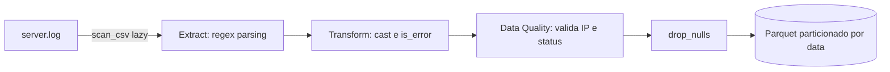

# 🚀 Log Analytics Engine

*Transformando logs de servidor brutos em um data lake analítico, particionado e comprimido.*


Pipeline de Engenharia de Dados que converte logs de acesso não estruturados em uma base analítica pronta para consulta. Usa parsing vetorizado com **Regex + Polars** para extrair campos estruturados do log bruto e grava o resultado em **Apache Parquet** particionado por data, reduzindo o volume de armazenamento em cerca de **95%** em relação ao arquivo original.

## 📑 Índice

- [Sobre o Projeto](#sobre-o-projeto)
- [Arquitetura do Pipeline](#arquitetura-do-pipeline)
- [Estrutura do Projeto](#estrutura-do-projeto)
- [Tecnologias Utilizadas](#tecnologias-utilizadas)
- [Pré-requisitos](#pré-requisitos)
- [Instalação e Execução](#instalação-e-execução)
- [Executando os Testes](#executando-os-testes)
- [Dados: Entrada e Saída](#dados-entrada-e-saída)
- [Schema dos Dados Processados](#schema-dos-dados-processados)
- [Consultas Analíticas no Data Lake](#consultas-analíticas-no-data-lake)
- [Dashboard Interativo](#dashboard-interativo)
- [Performance](#performance)


## Sobre o Projeto

Este projeto simula um cenário comum de engenharia de dados: transformar logs de acesso de servidor (Common Log Format) em uma base pronta para consultas analíticas. Ele resolve três problemas típicos desse tipo de dado:

- **Volume** — logs em texto puro ocupam muito espaço e são lentos para consultar.
- **Estrutura** — logs são texto livre; extrair campos exige um parsing confiável.
- **Consulta analítica** — formatos colunares como Parquet aceleram filtros e agregações.

O pipeline gera (ou consome) um arquivo de log, extrai os campos via regex, tipa e enriquece os dados com Polars, valida a qualidade dos registros e grava um dataset Parquet particionado por data — pronto para ser lido por ferramentas como DuckDB, Spark ou o próprio Polars.

## Arquitetura do Pipeline



1. **Extract** — `generator.py` cria um log sintético caso `data/raw/server.log` ainda não exista. `processor.py` faz a leitura *lazy* (`pl.scan_csv`) e extrai os campos `ip`, `date`, `endpoint`, `status` e `size` com uma única expressão regular (`str.extract_groups`).
2. **Transform & Data Quality** — `status` e `size` são convertidos para `Int32`; `date` é parseado como `Datetime` e reduzido a `dt_partition` (data); a flag booleana `is_error` marca requisições com `status >= 400`. Em seguida, um filtro rigoroso de **Qualidade de Dados** é aplicado: apenas requisições com IP em formato IPv4 válido e status HTTP entre 100 e 599 são mantidas. Linhas inválidas ou que não casam com o regex são descartadas com `drop_nulls()`.
3. **Load** — `main.py` apaga qualquer saída anterior em `data/processed/logs_lake` e grava o `DataFrame` final como Parquet particionado por `dt_partition`, usando o motor PyArrow.

Todo o pipeline roda em modo *lazy* até o `.collect()` final, permitindo que o Polars otimize o plano de execução antes de processar os dados de fato.

## Estrutura do Projeto

```
log-analytics-engine/
├── main.py              # Orquestra o pipeline: extract → transform → load
├── generator.py         # Gera logs sintéticos (Common Log Format)
├── processor.py         # Parsing via regex + transformações com Polars
├── test_processor.py    # Testes automatizados (pytest) do processor.py
├── requirements.txt     # Dependências Python (polars, pyarrow)
├── Dockerfile           # Imagem baseada em python:3.9-slim
├── docker-compose.yml   # Orquestra o container e monta o volume ./data
└── data/
    ├── raw/              # server.log — gerado automaticamente se ausente
    └── processed/        # logs_lake/ — dataset Parquet particionado
```

## Tecnologias Utilizadas

| Tecnologia | Função no projeto |
|---|---|
| **Python 3.9+** | Linguagem principal |
| **Polars** | Parsing e transformação vetorizada (API lazy) |
| **Regex** (`str.extract_groups`) | Extração de campos estruturados do log bruto |
| **PyArrow** | Motor de escrita e particionamento do Parquet |
| **Apache Parquet** | Formato de armazenamento colunar e comprimido |
| **Docker / Docker Compose** | Containerização e execução reprodutível |
| **Streamlit** | Dashboard interativo do Data Lake |
| **Plotly** | Gráficos interativos no dashboard |
| **logging** (stdlib) | Rastreabilidade da execução do pipeline |

## Pré-requisitos

- **Execução local:** Python 3.9+ e `pip`
- **Execução em container:** Docker e Docker Compose

## Instalação e Execução

### Opção 1 — Ambiente local

```bash
git clone https://github.com/gadelha-allan/log-analytics-engine.git
cd log-analytics-engine

python -m venv venv
source venv/bin/activate      # Windows: venv\Scripts\activate

pip install -r requirements.txt

python main.py
```

### Opção 2 — Docker (recomendado)

```bash
git clone https://github.com/gadelha-allan/log-analytics-engine.git
cd log-analytics-engine

docker-compose up --build
```

O `docker-compose.yml` monta o volume `./data:/app/data`, então os arquivos gerados e processados permanecem disponíveis no host mesmo depois que o container é removido.

## Executando os Testes

O projeto conta com uma suíte de testes automatizados (`test_processor.py`) que cobre o parsing via regex, as transformações aplicadas em `processor.py` e os filtros de qualidade de dados.

### Executando os Testes Unitários

O `pytest` já está listado no `requirements.txt`, então basta ter as dependências instaladas (seção [Instalação e Execução](#instalação-e-execução)). Na raiz do projeto, com o ambiente virtual ativado:

```bash
pytest test_processor.py -v
```

### O que é validado

- Extração dos campos `ip`, `endpoint`, `status` e `size` via regex.
- Descarte de linhas fora do padrão esperado, via `drop_nulls()`.
- Regra `is_error` (`True` quando `status >= 400`).
- Tipagem das colunas (`Int32`, `Date`, `Boolean`).
- Conversão da data original do log para o `Date` usado em `dt_partition`.
- **Qualidade de Dados**: descarte de registros com IP fora do formato IPv4 válido.
- **Qualidade de Dados**: descarte de registros com status HTTP fora da faixa 100–599.

Os testes usam arquivos temporários (via `tempfile`) como fixture, criados e removidos automaticamente a cada execução — nada é gravado em `data/raw`.

## Dados: Entrada e Saída

- **Entrada:** `data/raw/server.log`. Se o arquivo não existir, `main.py` chama `generate_mock_logs()` e gera **5.000.000** de linhas sintéticas automaticamente (valor definido em `main.py`; a função gera 1.000 linhas por padrão se for chamada isoladamente, sem argumentos).
- **Saída:** `data/processed/logs_lake/`, particionada por `dt_partition` no padrão Hive (`dt_partition=AAAA-MM-DD/*.parquet`). A cada execução a saída anterior é apagada e regravada — o pipeline é idempotente.

> 💡 **Dica:** para testes rápidos sem esperar a geração de 5 milhões de linhas, chame `generate_mock_logs("data/raw/server.log", lines=10_000)` manualmente antes de rodar `main.py`. Também vale adicionar `data/` ao `.gitignore`, já que logs e Parquet são artefatos gerados, não código-fonte.

## Schema dos Dados Processados

| Coluna | Tipo | Descrição |
|---|---|---|
| `ip` | String | Endereço IP de origem da requisição (validado como IPv4) |
| `date` | String | Timestamp original extraído do log |
| `method` | String | Método HTTP da requisição (`GET`, `POST`, `PUT`, `DELETE`, etc.) |
| `endpoint` | String | Rota acessada (ex.: `/login`, `/checkout`) |
| `status` | Int32 | Código de status HTTP da resposta (validado no intervalo 100–599) |
| `size` | Int32 | Tamanho da resposta em bytes |
| `dt_partition` | Date | Data derivada de `date`; chave de particionamento do Parquet |
| `is_error` | Boolean | `true` quando `status >= 400` |

Exemplo de linhas de log bruto (formato gerado por `generator.py`):

```
192.168.0.1 - - [27/Jul/2026:14:32:10 +0000] "GET /api/v1/users HTTP/1.1" 200 3421
10.0.0.5 - - [27/Jul/2026:15:00:00 +0000] "POST /login HTTP/1.1" 201 500
172.16.0.2 - - [27/Jul/2026:15:01:45 +0000] "DELETE /api/v1/users/7 HTTP/1.1" 404 128
```

O parser aceita qualquer método HTTP (`GET`, `POST`, `PUT`, `DELETE`, etc.).

## Consultas Analíticas no Data Lake

Os dados processados são salvos em formato **Apache Parquet particionado no padrão Hive** (`dt_partition=AAAA-MM-DD/*.parquet`), garantindo leitura *zero-copy* eficiente por motores analíticos (OLAP).

### Exemplo 1: Consulta SQL com DuckDB (Leitura Direta de Parquet)

O DuckDB permite consultar o Data Lake via SQL sem necessidade de um servidor de banco de dados rodando:

```python
import duckdb

con = duckdb.connect()

# Métricas agregadas lendo arquivos Parquet diretamente
df_metrics = con.execute("""
    SELECT 
        endpoint,
        COUNT(*) AS total_requests,
        ROUND(AVG(size), 2) AS avg_size_bytes,
        SUM(CASE WHEN is_error THEN 1 ELSE 0 END) AS total_errors
    FROM 'data/processed/logs_lake/*/*.parquet'
    GROUP BY endpoint
    ORDER BY total_requests DESC
""").df()

print(df_metrics)
```

### Exemplo 2: Consulta com PySpark

Para cenários de processamento massivo distribuído em cluster:

```python
from pyspark.sql import SparkSession

spark = SparkSession.builder \
    .appName("LogAnalytics") \
    .getOrCreate()

# O PySpark reconhece automaticamente as partições 'dt_partition' do Hive
df = spark.read.parquet("data/processed/logs_lake/")

# Agregação distribuída
df.groupBy("endpoint", "is_error") \
  .count() \
  .show()
```

## Dashboard Interativo

Para visualizar o painel executivo com gráficos em tempo real sobre o Data Lake:

```bash
streamlit run dashboard.py
```

> ⚠️ Execute `python main.py` antes para garantir que o Data Lake já foi gerado em `data/processed/logs_lake/`. O dashboard exibe um aviso e para caso a pasta não exista.

O painel cobre:

- **KPIs globais** — total de logs processados, volume de erros, taxa de erro HTTP e tamanho médio de resposta.
- **Top 10 endpoints** mais solicitados (gráfico de barras horizontal).
- **Distribuição de status HTTP** (gráfico de pizza/donut).

O Streamlit já está listado em `requirements.txt`. Se precisar instalar separadamente:

```bash
pip install streamlit plotly
```

## Performance

Benchmark real, executado localmente com o volume padrão do projeto (5 milhões de linhas):

| Métrica | Valor |
|---|---|
| Linhas processadas | 5.000.000 |
| Tamanho do log bruto (`.log`) | 369,5 MB |
| Tamanho do dataset Parquet | 18,3 MB |
| Redução de armazenamento | ~95% (compressão de ~20×) |
| Parsing + transformação + escrita | 11,6 s |
| Throughput | 430.275 linhas/s |
| Geração inicial dos logs sintéticos (etapa única) | 27,3 s |

*Medido em container Linux, Python 3.12, Polars 1.43.1. Os números variam conforme hardware e versões das bibliotecas.*


