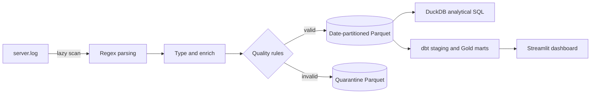

# 🚀 Log Analytics Engine

*Turning raw server logs into a compressed, partitioned analytical data lake.*


[Português (Brasil)](README.pt-BR.md)

Log Analytics Engine converts unstructured access logs into an analysis-ready data lake. It uses vectorized **Regex + Polars** parsing, writes date-partitioned **Apache Parquet**, and isolates rejected records in a traceable quarantine layer. **DuckDB** provides a production-style SQL analytics layer with CTEs, ranking, time-series windows, percentiles, and execution-plan examples.

## Architecture



1. **Extract** — `generator.py` can create Common Log Format data. `processor.py` lazily scans input and extracts `ip`, `date`, `method`, `endpoint`, `status`, and `size`.
2. **Transform and validate** — typed records gain `dt_partition` and `is_error`. Invalid rows receive a `rejection_reason`.
3. **Load** — valid records are streamed to Hive-style Parquet partitions; rejected records are stored separately.
4. **Model and analyze** — dbt models the Silver lake into a documented Gold star schema for the dashboard, while DuckDB runs versioned queries from [`sql/`](sql/README.md).

## Project layout

```text
log-analytics-engine/
├── src/                  # Pipeline, generator, query runner, and dashboard
├── dbt/                  # dbt staging, Gold dimensions, facts, and marts
├── sql/                  # Versioned DuckDB analytical queries
├── docs/                 # Performance and execution-plan notes
├── tests/                # Unit, integration, and SQL tests
├── README.md             # Primary documentation (English)
├── README.pt-BR.md       # Portuguese documentation
├── LICENSE               # MIT license
└── data/                 # Locally generated raw, lake, and quarantine data
```

## Stack

| Technology | Role |
|---|---|
| Python 3.10+ | Pipeline and application runtime |
| Polars | Lazy, vectorized parsing and transformation |
| Apache Parquet / PyArrow | Compressed columnar storage and partitioning |
| DuckDB | In-process analytical SQL over Parquet |
| dbt + dbt-duckdb | Medallion modeling, star schema, data tests, and documentation |
| Streamlit / Plotly | Interactive dashboard |
| pytest, Ruff, Black, MyPy | Tests and code quality |
| Docker / Compose | Reproducible runtime |

## Quick start

```bash
git clone https://github.com/gadelha-allan/log-analytics-engine.git
cd log-analytics-engine
python -m venv venv
source venv/bin/activate  # Windows: venv\Scripts\activate
pip install -r requirements.txt
python -m src.main --generate --lines 10000
```

The default production-sized run generates five million lines. For containers, run `docker compose up --build`; the dashboard is exposed at `http://localhost:8501`.

## Command-line interface

```bash
python -m src.main [OPTIONS]
```

| Option | Default | Description |
|---|---|---|
| `--raw` | `data/raw/server.log` | Input log path |
| `--output` | `data/processed/logs_lake` | Partitioned Parquet output |
| `--quarantine` | `data/processed/quarantine` | Rejected-record output |
| `--generate` | `False` | Generate input when it does not exist |
| `--lines` | `5_000_000` | Number of synthetic lines to generate |

## Processed schema

| Column | Type | Description |
|---|---|---|
| `ip` | String | Client IPv4 address |
| `date` | String | Original log timestamp |
| `method` | String | HTTP method |
| `endpoint` | String | Requested route |
| `status` | Int32 | HTTP status in the 100–599 range |
| `size` | Int32 | Response size in bytes |
| `dt_partition` | Date | Date-derived Parquet partition key |
| `is_error` | Boolean | `true` when `status >= 400` |

Quality failures are stored in `data/processed/quarantine/quarantine.parquet` as `regex_mismatch`, `invalid_status`, or `negative_size`.

## Advanced SQL analytics

The [`sql/`](sql/README.md) directory contains ten executable DuckDB queries covering daily traffic, period-based top endpoints, `ROW_NUMBER`, `RANK`, `LAG`, `LEAD`, seven-day rolling request/error averages, response-size percentiles, outliers, endpoint share, and status distribution.

Generate the lake and run every query:

```bash
python -m src.query_lake
```

Run selected queries or another lake:

```bash
python -m src.query_lake --query 03_daily_change --query 05_response_size_percentiles
python -m src.query_lake --lake-path '/tmp/logs_lake/**/*.parquet'
```

Queries use `read_parquet(..., hive_partitioning = true)`, allowing filters on `dt_partition` to prune partitions. See [`docs/sql-performance.md`](docs/sql-performance.md) for reproducible `EXPLAIN` and `EXPLAIN ANALYZE` workflows.

## Gold dimensional layer

The dbt project treats the Polars lake as Silver and materializes `gold.fact_requests`, `gold.dim_date`, `gold.dim_endpoint`, `gold.mart_daily_traffic`, and `gold.mart_endpoint_health` in DuckDB.

```bash
cp dbt/profiles.yml.example dbt/profiles.yml
dbt build --project-dir dbt --profiles-dir dbt
dbt docs generate --project-dir dbt --profiles-dir dbt
```

See [`docs/gold-star-schema.md`](docs/gold-star-schema.md) for grains, relationships, and the dimensional diagram.

## Dashboard

```bash
streamlit run src/dashboard.py
```

After `dbt build`, the dashboard reads Gold marts for KPIs, endpoint health, and daily traffic; before that it safely reads the Silver Parquet lake. It also shows HTTP status distribution and quarantine statistics.

## Tests and quality checks

```bash
pip install -r requirements-dev.txt
pytest
ruff check src/ tests/
black --check src/ tests/
mypy src/
```

Tests use temporary directories and do not write to project data. The original five-million-row benchmark produced 18.3 MB of Parquet from a 369.5 MB log (about 95% smaller) at roughly 430,000 rows/second; results vary by environment.

## License

Distributed under the [MIT License](LICENSE).
