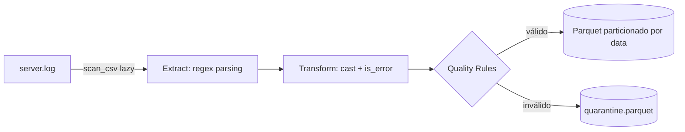

# 🚀 Log Analytics Engine

*Transformando logs de servidor brutos em um data lake analítico, particionado e comprimido.*


Pipeline de Engenharia de Dados que converte logs de acesso não estruturados em uma base analítica pronta para consulta. Usa parsing vetorizado com **Regex + Polars** para extrair campos estruturados do log bruto e grava o resultado em **Apache Parquet** particionado por data, reduzindo o volume de armazenamento em cerca de **95%** em relação ao arquivo original. Registros inválidos são isolados automaticamente em uma camada de **quarentena** com motivo de rejeição rastreável.

## 📑 Índice

- [Sobre o Projeto](#sobre-o-projeto)
- [Arquitetura do Pipeline](#arquitetura-do-pipeline)
- [Estrutura do Projeto](#estrutura-do-projeto)
- [Tecnologias Utilizadas](#tecnologias-utilizadas)
- [Pré-requisitos](#pré-requisitos)
- [Instalação e Execução](#instalação-e-execução)
- [CLI — Opções Disponíveis](#cli--opções-disponíveis)
- [Executando os Testes](#executando-os-testes)
- [Dados: Entrada e Saída](#dados-entrada-e-saída)
- [Schema dos Dados Processados](#schema-dos-dados-processados)
- [Quarentena de Qualidade](#quarentena-de-qualidade)
- [Consultas Analíticas no Data Lake](#consultas-analíticas-no-data-lake)
- [Dashboard Interativo](#dashboard-interativo)
- [Performance](#performance)
- [CI/CD](#cicd)

---

## Sobre o Projeto

Este projeto simula um cenário comum de engenharia de dados: transformar logs de acesso de servidor (Common Log Format) em uma base pronta para consultas analíticas. Ele resolve **quatro** problemas típicos desse tipo de dado:

- **Volume** — logs em texto puro ocupam muito espaço e são lentos para consultar.
- **Estrutura** — logs são texto livre; extrair campos exige um parsing confiável.
- **Qualidade** — logs reais contêm linhas malformadas, IPs inválidos e status fora do padrão HTTP.
- **Consulta analítica** — formatos colunares como Parquet aceleram filtros e agregações.

O pipeline gera (ou consome) um arquivo de log, extrai os campos via regex, tipa e enriquece os dados com Polars, aplica regras de qualidade de dados, grava um dataset Parquet particionado por data — pronto para ser lido por DuckDB, Spark ou o próprio Polars — e isola as linhas rejeitadas em uma pasta de quarentena com o motivo de rejeição catalogado.

---

## Arquitetura do Pipeline



1. **Extract** — `generator.py` cria um log sintético caso `data/raw/server.log` ainda não exista. `processor.py` faz a leitura *lazy* (`pl.scan_csv`) e extrai os campos `ip`, `date`, `method`, `endpoint`, `status` e `size` com uma única expressão regular (`str.extract_groups`).

2. **Transform & Data Quality** — `status` e `size` são convertidos para `Int32`; `date` é parseado como `Datetime` e reduzido a `dt_partition` (`Date`); a flag booleana `is_error` marca requisições com `status >= 400`. Um filtro de **Qualidade de Dados** em três camadas é então aplicado:
   - `regex_mismatch` — linha não casou com o padrão (IP, status ou size nulos).
   - `invalid_status` — status HTTP fora do intervalo 100–599.
   - `negative_size` — tamanho de resposta negativo.

3. **Load** — `main.py` apaga a saída anterior e grava o `LazyFrame` válido como Parquet particionado por `dt_partition` via `sink_parquet` (streaming). Linhas rejeitadas são gravadas em `data/processed/quarantine/quarantine.parquet` com a coluna `rejection_reason`.

Todo o pipeline roda em modo *lazy* até o passo de escrita, permitindo que o Polars otimize o plano de execução antes de processar os dados de fato.

---

## Estrutura do Projeto

```
log-analytics-engine/
├── src/
│   ├── main.py           # Orquestra o pipeline com CLI (argparse)
│   ├── processor.py      # Parsing via regex + qualidade de dados com Polars
│   ├── generator.py      # Gera logs sintéticos realistas (Common Log Format)
│   ├── query_lake.py     # Consultas analíticas com DuckDB
│   └── dashboard.py      # Dashboard executivo interativo (Streamlit + Plotly)
├── tests/
│   ├── conftest.py       # Fixtures compartilhadas (pytest)
│   ├── test_processor.py # Testes unitários do processor.py
│   └── test_integration.py # Teste end-to-end do pipeline completo
├── .github/
│   └── workflows/
│       └── ci.yml        # Pipeline CI: lint, type-check, testes (Python 3.10–3.12)
├── pyproject.toml        # Metadados do projeto, dependências e configuração de ferramentas
├── requirements.txt      # Dependências pinadas para reprodutibilidade
├── requirements-dev.txt  # Dependências de desenvolvimento (pytest, ruff, mypy, black)
├── Dockerfile            # Imagem baseada em python:3.12-slim
├── docker-compose.yml    # Serviços: pipeline ETL + dashboard Streamlit
└── data/                 # Gerada automaticamente — não versionada
    ├── raw/              #   server.log — gerado se ausente
    └── processed/        #   logs_lake/ — Parquet particionado
                          #   quarantine/ — registros rejeitados
```

---

## Tecnologias Utilizadas

| Tecnologia | Função no projeto |
|---|---|
| **Python 3.10+** | Linguagem principal |
| **Polars** | Parsing e transformação vetorizada (API lazy + streaming) |
| **Regex** (`str.extract_groups`) | Extração de campos estruturados do log bruto |
| **PyArrow** | Motor de escrita e particionamento do Parquet |
| **Apache Parquet** | Formato de armazenamento colunar e comprimido |
| **DuckDB** | Consultas SQL analíticas direto nos arquivos Parquet |
| **Faker** | Geração de dados sintéticos realistas (IPs, endpoints, timestamps) |
| **Streamlit** | Dashboard interativo do Data Lake |
| **Plotly** | Gráficos interativos no dashboard |
| **Docker / Docker Compose** | Containerização e execução reprodutível (ETL + Dashboard) |
| **GitHub Actions** | CI com lint, type-check e testes em matriz Python 3.10–3.12 |
| **Ruff** | Linter e formatação rápida |
| **Mypy** | Verificação estática de tipos |
| **Black** | Formatação de código |
| **pytest + pytest-cov** | Testes automatizados com cobertura |
| **logging** (stdlib) | Rastreabilidade da execução do pipeline |

---

## Pré-requisitos

- **Execução local:** Python 3.10+ e `pip`
- **Execução em container:** Docker e Docker Compose

---

## Instalação e Execução

### Opção 1 — Ambiente local

```bash
git clone https://github.com/gadelha-allan/log-analytics-engine.git
cd log-analytics-engine

python -m venv venv
source venv/bin/activate      # Windows: venv\Scripts\activate

pip install -r requirements.txt

# Executa o pipeline gerando os logs automaticamente
python -m src.main --generate
```

### Opção 2 — Docker (recomendado)

```bash
git clone https://github.com/gadelha-allan/log-analytics-engine.git
cd log-analytics-engine

docker-compose up --build
```

O `docker-compose.yml` sobe dois serviços:
- **`log-engine`** — executa o pipeline ETL e grava o Data Lake em `./data`.
- **`dashboard`** — aguarda o Data Lake ser gerado e sobe o painel em `http://localhost:8501`.

O volume `./data:/app/data` mantém os artefatos gerados disponíveis no host mesmo após o container ser removido.

---

## CLI — Opções Disponíveis

```bash
python -m src.main [OPÇÕES]
```

| Flag | Padrão | Descrição |
|---|---|---|
| `--raw` | `data/raw/server.log` | Caminho do arquivo `.log` de entrada |
| `--output` | `data/processed/logs_lake` | Diretório de saída (Parquet particionado) |
| `--quarantine` | `data/processed/quarantine` | Diretório de quarentena |
| `--generate` | `False` | Gera logs sintéticos se o arquivo não existir |
| `--lines` | `5_000_000` | Número de linhas a gerar (requer `--generate`) |

**Exemplos:**

```bash
# Usa um log existente
python -m src.main --raw /var/log/nginx/access.log

# Gera 1 milhão de linhas e processa
python -m src.main --generate --lines 1_000_000

# Teste rápido com 10 mil linhas
python -m src.main --generate --lines 10_000
```

---

## Executando os Testes

O projeto conta com testes unitários e um teste de integração end-to-end.

### Instalação das dependências de desenvolvimento

```bash
pip install -r requirements-dev.txt
```

### Rodando a suíte completa

```bash
pytest
```

### Apenas testes unitários do processor

```bash
pytest tests/test_processor.py -v
```

### Com relatório de cobertura

```bash
pytest --cov=src --cov-report=term-missing
```

### O que é validado

**Testes unitários (`test_processor.py`):**
- Extração dos campos `ip`, `method`, `endpoint`, `status` e `size` via regex.
- Tipagem das colunas (`Int32`, `Date`, `Boolean`).
- Regra `is_error` (`True` quando `status >= 400`).
- Descarte e classificação de linhas inválidas na quarentena (`regex_mismatch`, `invalid_status`).
- Coluna `rejection_reason` presente nos registros rejeitados.
- Idempotência do pipeline (execuções consecutivas produzem o mesmo resultado).

**Teste de integração (`test_integration.py`):**
- Execução completa do fluxo: geração de logs → `run_pipeline()` → verificação das partições Parquet geradas.

Os testes usam arquivos temporários via fixtures `pytest` (`tmp_path`, `tempfile`) — nada é gravado em `data/`.

---

## Dados: Entrada e Saída

- **Entrada:** `data/raw/server.log`. Se o arquivo não existir e `--generate` for passado, `main.py` chama `generate_mock_logs()` e gera **5.000.000** de linhas sintéticas com distribuição realista de IPs, endpoints, métodos HTTP e códigos de status.
- **Saída válida:** `data/processed/logs_lake/`, particionada por `dt_partition` no padrão Hive (`dt_partition=AAAA-MM-DD/*.parquet`).
- **Saída de quarentena:** `data/processed/quarantine/quarantine.parquet` — apenas gerado quando há linhas rejeitadas.

A cada execução a saída anterior é apagada e regravada — o pipeline é **idempotente**.

> 💡 **Dica:** para testes rápidos sem aguardar a geração de 5 milhões de linhas, use `--lines 10_000`. Adicione `data/` ao `.gitignore`, pois logs e Parquet são artefatos gerados, não código-fonte.

---

## Schema dos Dados Processados

| Coluna | Tipo | Descrição |
|---|---|---|
| `ip` | String | Endereço IPv4 de origem da requisição |
| `date` | String | Timestamp original extraído do log |
| `method` | String | Método HTTP (`GET`, `POST`, `PUT`, `DELETE`, `PATCH`, `HEAD`) |
| `endpoint` | String | Rota acessada (ex.: `/login`, `/api/v1/products/42`) |
| `status` | Int32 | Código de status HTTP (intervalo válido: 100–599) |
| `size` | Int32 | Tamanho da resposta em bytes (≥ 0) |
| `dt_partition` | Date | Data derivada de `date`; chave de particionamento do Parquet |
| `is_error` | Boolean | `true` quando `status >= 400` |

Exemplo de linhas de log bruto (formato gerado por `generator.py`):

```
192.168.0.1 - - [27/Jul/2026:14:32:10 +0000] "GET /api/v1/users HTTP/1.1" 200 3421
10.0.0.5 - - [27/Jul/2026:15:00:00 +0000] "POST /login HTTP/1.1" 201 500
172.16.0.2 - - [27/Jul/2026:15:01:45 +0000] "DELETE /api/v1/users/7 HTTP/1.1" 404 128
```

---

## Quarentena de Qualidade

Registros que não passam nas regras de qualidade são isolados em `data/processed/quarantine/quarantine.parquet` com uma coluna adicional `rejection_reason`:

| Motivo | Condição |
|---|---|
| `regex_mismatch` | Linha não casou com o padrão do log (IP, status ou size nulos) |
| `invalid_status` | Status HTTP fora do intervalo 100–599 |
| `negative_size` | Tamanho de resposta negativo |

O dashboard exibe automaticamente a tabela de quarentena com contagem e percentual por motivo quando o arquivo existir.

---

## Consultas Analíticas no Data Lake

Os dados são salvos em **Apache Parquet particionado no padrão Hive** (`dt_partition=AAAA-MM-DD/*.parquet`), compatível com leitura *zero-copy* por motores OLAP.

O módulo `src/query_lake.py` expõe duas consultas prontas via DuckDB:

```bash
python -m src.query_lake
```

### Exemplo 1: SQL com DuckDB (leitura direta de Parquet)

```python
import duckdb

con = duckdb.connect()

df_metrics = con.execute("""
    SELECT
        endpoint,
        COUNT(*) AS total_requests,
        ROUND(AVG(size), 2) AS avg_size_bytes,
        SUM(CASE WHEN is_error THEN 1 ELSE 0 END) AS total_errors
    FROM 'data/processed/logs_lake/*/*.parquet'
    GROUP BY endpoint
    ORDER BY total_requests DESC
""").df()
```

### Exemplo 2: Polars com predicate pushdown

```python
import polars as pl

df = (
    pl.scan_parquet("data/processed/logs_lake/**/*.parquet")
    .filter(pl.col("is_error"))
    .group_by("endpoint")
    .agg(pl.len().alias("errors"))
    .sort("errors", descending=True)
    .collect()
)
```

### Exemplo 3: PySpark para processamento distribuído

```python
from pyspark.sql import SparkSession

spark = SparkSession.builder.appName("LogAnalytics").getOrCreate()

df = spark.read.parquet("data/processed/logs_lake/")
df.groupBy("endpoint", "is_error").count().show()
```

---

## Dashboard Interativo

```bash
streamlit run src/dashboard.py
```

> ⚠️ Execute `python -m src.main --generate` antes para garantir que o Data Lake já foi gerado. O dashboard exibe um aviso e para caso a pasta não exista.

O painel cobre:

- **KPIs globais** — total de logs, volume de erros, taxa de erro HTTP, tamanho médio de resposta, IPs únicos, endpoints únicos e score de qualidade dos dados.
- **Top 10 endpoints** mais solicitados (gráfico de barras horizontal).
- **Distribuição de status HTTP** (gráfico de pizza/donut).
- **Volume de requisições ao longo do tempo** — série temporal com volume total e erros por data.
- **Tabela de quarentena** — motivos de rejeição com contagem e percentual (exibida apenas quando há dados rejeitados).

---

## Performance

Benchmark executado localmente com o volume padrão do projeto (5 milhões de linhas):

| Métrica | Valor |
|---|---|
| Linhas processadas | 5.000.000 |
| Tamanho do log bruto (`.log`) | 369,5 MB |
| Tamanho do dataset Parquet | 18,3 MB |
| Redução de armazenamento | ~95% (compressão de ~20×) |
| Parsing + transformação + escrita | 11,6 s |
| Throughput | 430.275 linhas/s |
| Geração dos logs sintéticos (etapa única) | 27,3 s |

*Medido em container Linux, Python 3.12, Polars 1.12.0, PyArrow 17.0.0. Os números variam conforme hardware e versões das bibliotecas.*

---

## CI/CD

A cada push ou pull request, o GitHub Actions executa:

| Etapa | Ferramenta | O que verifica |
|---|---|---|
| Lint | Ruff | Código limpo e sem erros de estilo |
| Formatação | Black | Consistência de formatação |
| Type check | MyPy | Tipos corretos em toda a base de código |
| Testes | pytest + pytest-cov | Testes unitários, integração e cobertura |

Matriz de Python: **3.10, 3.11, 3.12**.

```yaml
# .github/workflows/ci.yml
name: CI
on: [push, pull_request]
jobs:
  lint-and-test:
    runs-on: ubuntu-latest
    strategy:
      matrix:
        python-version: ["3.10", "3.11", "3.12"]
    steps:
      - uses: actions/checkout@v4
      - uses: actions/setup-python@v5
        with:
          python-version: ${{ matrix.python-version }}
      - run: pip install -r requirements-dev.txt
      - run: ruff check src/ tests/
      - run: black --check src/ tests/
      - run: mypy src/
      - run: pytest --cov=src --cov-report=xml
      - uses: codecov/codecov-action@v4
        with:
          files: ./coverage.xml
          fail_ci_if_error: false
```

---
