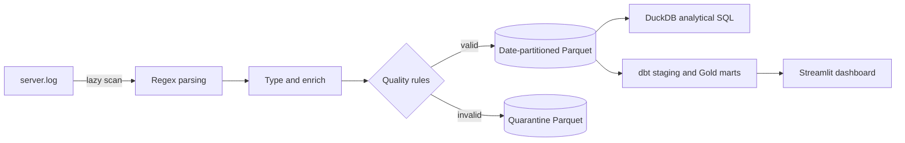

# Log Analytics Engine

[Português (Brasil)](README.pt-BR.md)

Parses HTTP access logs with Polars and writes date-partitioned Parquet. Rejected records go to quarantine with their original lines and rejection reasons. DuckDB runs the SQL queries, and dbt builds the Gold models used by the Streamlit dashboard.

## Architecture


```mermaid
flowchart LR
    A[server.log] -->|lazy scan| B[Regex parsing]
    B --> C[Type and enrich]
    C --> D{Quality rules}
    D -->|valid| E[(Date-partitioned Parquet)]
    D -->|invalid| F[(Quarantine Parquet)]
    E --> G[DuckDB analytical SQL]
    E --> H[dbt staging and Gold marts]
    H --> I[Streamlit dashboard]
```

`generator.py` creates synthetic logs. `processor.py` parses and validates them, then writes the lake and quarantine. dbt builds the Gold tables, while [`sql/`](sql/README.md) contains the DuckDB queries.

## Project layout

```text
log-analytics-engine/
├── src/                  # Pipeline, generator, query runner, and dashboard
├── dbt/                  # dbt staging, Gold dimensions, facts, and marts
├── sql/                  # Versioned DuckDB analytical queries
├── docs/                 # Performance and execution-plan notes
├── tests/                # Unit, integration, and SQL tests
├── README.md             # Primary documentation (English)
├── README.pt-BR.md       # Portuguese documentation
├── LICENSE               # MIT license
└── data/                 # Locally generated raw, lake, and quarantine data
```

## Stack

| Technology | Role |
|---|---|
| Python 3.10+ | Pipeline and application runtime |
| Polars | Lazy, vectorized parsing and transformation |
| Apache Parquet / PyArrow | Compressed columnar storage and partitioning |
| DuckDB | In-process analytical SQL over Parquet |
| dbt + dbt-duckdb | Medallion modeling, star schema, data tests, and documentation |
| Streamlit / Plotly | Interactive dashboard |
| pytest, Ruff, Black, MyPy | Tests and code quality |
| Docker / Compose | Reproducible runtime |

## Quick start

```bash
git clone https://github.com/gadelha-allan/log-analytics-engine.git
cd log-analytics-engine
python -m venv venv
source venv/bin/activate  # Windows: venv\Scripts\activate
pip install -r requirements.txt
python -m src.main --generate --lines 10000
```

With `--generate`, the default is five million lines when the input file does not exist. For containers, run `docker compose up --build`; the dashboard is exposed at `http://localhost:8501`.

## Command-line interface

```bash
python -m src.main [OPTIONS]
```

| Option | Default | Description |
|---|---|---|
| `--raw` | `data/raw/server.log` | Input log path |
| `--output` | `data/processed/logs_lake` | Partitioned Parquet output |
| `--quarantine` | `data/processed/quarantine` | Rejected-record output |
| `--generate` | `False` | Generate input when it does not exist |
| `--lines` | `5_000_000` | Number of synthetic lines to generate |
| `--full-refresh` | `False` | Authorize replacing published data with a complete rebuild |

The first run is allowed when the lake and quarantine contain no files. Later runs require `--full-refresh`; without it, the CLI exits with an error and preserves the published files. The input must contain the entire dataset to publish. A file containing only one day replaces the previous dataset when the flag is supplied.

```bash
python -m src.main --raw data/raw/server.log --full-refresh
```

## Processed schema

| Column | Type | Description |
|---|---|---|
| `raw` | String | Original log line, excluding the line terminator |
| `ip` | String | Client IPv4 address |
| `date` | String | Original log timestamp |
| `method` | String | HTTP method |
| `endpoint` | String | Requested route |
| `status` | Int32 | HTTP status in the 100–599 range |
| `size` | Int64 | Response size in bytes |
| `dt_partition` | Date | Date-derived Parquet partition key |
| `is_error` | Boolean | `true` when `status >= 400` |

Quality failures are stored in `data/processed/quarantine/quarantine.parquet` with the original line in `raw`, the extracted fields (which may be null), and a `rejection_reason`: `regex_mismatch`, `invalid_status`, `negative_size`, or `invalid_date`. The original line is preserved without its line terminator, including spaces, commas, and quotes, even when parsing fails. Each input line appears exactly once in either the valid output or quarantine, so `total_input = valid_count + quarantine_count`. Tests read the quarantine Parquet and verify the original lines and their rejection reasons.

## SQL queries

The [`sql/`](sql/README.md) directory contains ten DuckDB queries for daily traffic, top endpoints, rankings, changes between dates, moving averages over seven observed dates, response-size percentiles, outliers, endpoint share, and status distribution.

Run all queries against an existing lake:

```bash
python -m src.query_lake
```

Run selected queries or another lake:

```bash
python -m src.query_lake --query 03_daily_change --query 05_response_size_percentiles
python -m src.query_lake --lake-path '/tmp/logs_lake/**/*.parquet'
```

Queries use `read_parquet(..., hive_partitioning = true)`, allowing filters on `dt_partition` to prune partitions. See [`docs/sql-performance.md`](docs/sql-performance.md) for `EXPLAIN` and `EXPLAIN ANALYZE` examples.

## Gold dimensional layer

The dbt project treats the Polars lake as Silver and materializes `gold.fact_requests`, `gold.dim_date`, `gold.dim_endpoint`, `gold.mart_daily_traffic`, and `gold.mart_endpoint_health` in DuckDB.

```bash
cp dbt/profiles.yml.example dbt/profiles.yml
dbt build --project-dir dbt --profiles-dir dbt
dbt docs generate --project-dir dbt --profiles-dir dbt
```

See [`docs/gold-star-schema.md`](docs/gold-star-schema.md) for grains, relationships, and the dimensional diagram.

## Dashboard

```bash
streamlit run src/dashboard.py
```

After `dbt build`, the dashboard reads Gold marts for KPIs, endpoint health, and daily traffic; before that it reads the Silver Parquet lake. It also shows HTTP status distribution and quarantine statistics.

## Tests and quality checks

```bash
pip install -r requirements-dev.txt
pytest
ruff check src/ tests/
black --check src/ tests/
mypy src/
```

Tests use temporary directories and do not write to project data. The original five-million-row benchmark produced 18.3 MB of Parquet from a 369.5 MB log (about 95% smaller) at roughly 430,000 rows/second; results vary by environment.

## License

Distributed under the [MIT License](LICENSE).
