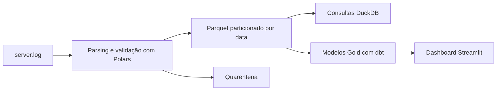

# Log Analytics Engine

[English](README.md)

Processa logs de acesso HTTP com Polars e grava Parquet particionado por data. Registros rejeitados ficam na quarentena com a linha original e o motivo. DuckDB executa as consultas SQL, e dbt constrói os modelos Gold usados pelo dashboard Streamlit.

## Fluxo



`src/generator.py` gera logs sintéticos. `src/processor.py` extrai os campos, valida datas, IPs, status e tamanhos e grava o lake e a quarentena. `src/main.py` expõe a CLI.

| Pasta | Conteúdo |
|---|---|
| `src/` | Pipeline, gerador, consultas e dashboard |
| `tests/` | Testes do parser, da CLI, de integração e das consultas SQL |
| `sql/` | Dez consultas DuckDB |
| `dbt/` | Staging, dimensões, fatos e agregações Gold |
| `docs/` | Modelo de dados e planos de execução |
| `data/` | Logs e dados produzidos localmente, fora do Git |

## Execução local

Requer Python 3.10 ou superior. Na raiz do repositório:

```bash
git clone https://github.com/gadelha-allan/log-analytics-engine.git
cd log-analytics-engine
python -m venv venv
source venv/bin/activate  # Windows: venv\Scripts\activate
pip install -r requirements.txt
python -m src.main --generate --lines 10000
```

A primeira execução gera a entrada quando ela não existe e grava o lake e a quarentena em `data/processed/`. `--generate` não regrava uma entrada que já existe.

## Docker

```bash
docker compose up --build
```

O serviço `log-engine` executa o pipeline com cinco milhões de linhas como padrão de geração. O `dashboard` atende em `http://localhost:8501`. O volume `./data:/app/data` mantém os dados no host.

Se já houver dados publicados, o pipeline exige `--full-refresh`, também no container:

```bash
docker compose run --rm log-engine python -m src.main --raw data/raw/server.log --full-refresh
```

## CLI

```bash
python -m src.main --help
```

| Opção | Padrão | Uso |
|---|---|---|
| `--raw` | `data/raw/server.log` | Arquivo de entrada |
| `--output` | `data/processed/logs_lake` | Parquet particionado |
| `--quarantine` | `data/processed/quarantine` | Registros rejeitados |
| `--generate` | `False` | Gera a entrada se ela não existir |
| `--lines` | `5_000_000` | Quantidade de linhas para geração |
| `--full-refresh` | `False` | Autoriza substituir o conjunto publicado |

A primeira execução é permitida quando o lake e a quarentena não contêm arquivos. Se já houver arquivos, executar sem `--full-refresh` retorna erro e mantém a saída anterior intacta.

Com a flag, a entrada substitui todo o conjunto publicado. Ela precisa conter todos os registros que você deseja manter. Um arquivo com apenas um dia substitui o conjunto anterior; não faz atualização incremental.

```bash
python -m src.main --raw data/raw/server.log --full-refresh
```

## Dados processados

O lake fica em `data/processed/logs_lake/dt_partition=AAAA-MM-DD/*.parquet`.

| Coluna | Tipo | Conteúdo |
|---|---|---|
| `raw` | String | Linha original, sem o terminador de linha |
| `ip` | String | IPv4 do cliente |
| `date` | String | Timestamp extraído do log |
| `method` | String | Método HTTP |
| `endpoint` | String | Rota e query string |
| `status` | Int32 | Status HTTP entre 100 e 599 |
| `size` | Int64 | Tamanho da resposta em bytes, maior ou igual a zero |
| `dt_partition` | Date | Data derivada de `date`, usada no particionamento |
| `is_error` | Boolean | `true` quando `status >= 400` |

## Quarentena

`data/processed/quarantine/quarantine.parquet` é gravado quando há rejeições. Contém `raw`, os campos extraídos, que podem ser nulos, e `rejection_reason`.

| Motivo | Condição |
|---|---|
| `regex_mismatch` | A linha não corresponde ao formato do log ou IP, status ou tamanho ficam nulos |
| `invalid_status` | Status HTTP fora de 100 a 599 |
| `negative_size` | Tamanho negativo |
| `invalid_date` | Data que não pode ser convertida |

`raw` conserva espaços, vírgulas e aspas. Cada linha aparece uma vez no lake ou na quarentena, incluindo duplicatas: `total_input = valid_count + quarantine_count`.

## Consultas SQL

Veja o catálogo em [`sql/README.md`](sql/README.md). Com o lake gerado:

```bash
python -m src.query_lake --list
python -m src.query_lake
python -m src.query_lake --query 03_daily_change --query 05_response_size_percentiles
python -m src.query_lake --lake-path '/tmp/logs_lake/**/*.parquet'
```

As consultas leem o Parquet com `hive_partitioning = true`. Filtros em `dt_partition` podem reduzir os arquivos lidos. Há exemplos de `EXPLAIN` e `EXPLAIN ANALYZE` em [`docs/sql-performance.md`](docs/sql-performance.md).

## Modelos dbt

Depois de gerar o lake, crie o perfil local e construa os modelos:

```bash
cp dbt/profiles.yml.example dbt/profiles.yml
dbt build --project-dir dbt --profiles-dir dbt
dbt docs generate --project-dir dbt --profiles-dir dbt
```

O perfil padrão grava `data/log_analytics.duckdb`. O Gold contém `fact_requests`, `dim_date`, `dim_endpoint`, `mart_daily_traffic` e `mart_endpoint_health`.

Veja [`docs/dbt-medallion.md`](docs/dbt-medallion.md) e [`docs/gold-star-schema.md`](docs/gold-star-schema.md) para os caminhos, relações e granularidade dos modelos.

## Dashboard

```bash
streamlit run src/dashboard.py
```

O dashboard consulta as agregações Gold quando disponíveis e usa o lake Silver nos demais casos. Mostra volume de requisições, erros HTTP, tamanho médio, endpoints, série diária e rejeições por motivo.

## Testes

```bash
pip install -r requirements-dev.txt
python -m pytest
python -m pytest tests/test_processor.py -v
ruff check src/ tests/
black --check src/ tests/
mypy src/
```

Os testes usam diretórios temporários. Conferem campos extraídos, tipos, motivos de rejeição, conteúdo da quarentena, conservação das contagens e recusa de reprocessamento sem `--full-refresh`.

A CI executa lint, formatação, Mypy e testes em Python 3.10, 3.11 e 3.12. Também constrói a imagem Docker e executa o pipeline com mil registros.

## Medição de desempenho

Uma execução anterior com cinco milhões de linhas gerou 18,3 MB de Parquet a partir de 369,5 MB de log, em 11,6 segundos de processamento. A medição usou Linux, Python 3.12, Polars 1.12.0 e PyArrow 17.0.0. Volume, schema, versões e hardware afetam esses resultados.

## Licença

[MIT](LICENSE).
