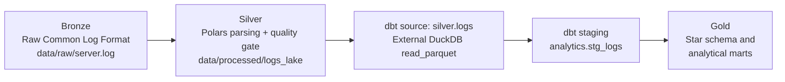

# dbt Medallion architecture

The project uses a Medallion architecture with clear ownership boundaries. dbt does not replace the existing Polars processor: Polars remains the parser and data-quality gate.



| Layer | Owner | Storage / contract | Responsibilities |
|---|---|---|---|
| Bronze | Log producer | `data/raw/server.log` | Immutable, unstructured Common Log Format input. |
| Silver | Polars pipeline | `data/processed/logs_lake/dt_partition=*/` | Regex parsing, type conversion, validation, rejection quarantine, and partitioned Parquet output. |
| dbt staging | dbt + DuckDB | `analytics.stg_logs` view | Stable, typed analytical names and documentation over Silver. |
| Gold | dbt + DuckDB | `gold.fact_requests`, dimensions, and marts | Dimensional facts, conformed dimensions, aggregates, KPIs, and dashboard-ready models. |

## Setup

Install runtime dependencies, generate the Silver lake, and create a local dbt profile:

```bash
pip install -r requirements.txt
python -m src.main --generate --lines 10000
cp dbt/profiles.yml.example dbt/profiles.yml
```

The default profile writes the DuckDB database to `data/log_analytics.duckdb`. The commands must be run from the repository root; override the paths when needed:

```bash
export DBT_DUCKDB_PATH=/tmp/log_analytics.duckdb
export LOG_ANALYTICS_SILVER_PATH='data/processed/logs_lake/**/*.parquet'
```

Run from the repository root:

```bash
dbt debug --project-dir dbt --profiles-dir dbt
dbt run --project-dir dbt --profiles-dir dbt
```

`dbt run` creates the `analytics.stg_logs` view. `dbt build` also materializes the Gold star schema and runs its tests. Verify the staging view in DuckDB:

```sql
select * from analytics.stg_logs limit 10;
```

The `LOG_ANALYTICS_SILVER_PATH` value is evaluated by dbt in the source definition. Use a path relative to the repository root or an absolute path.
