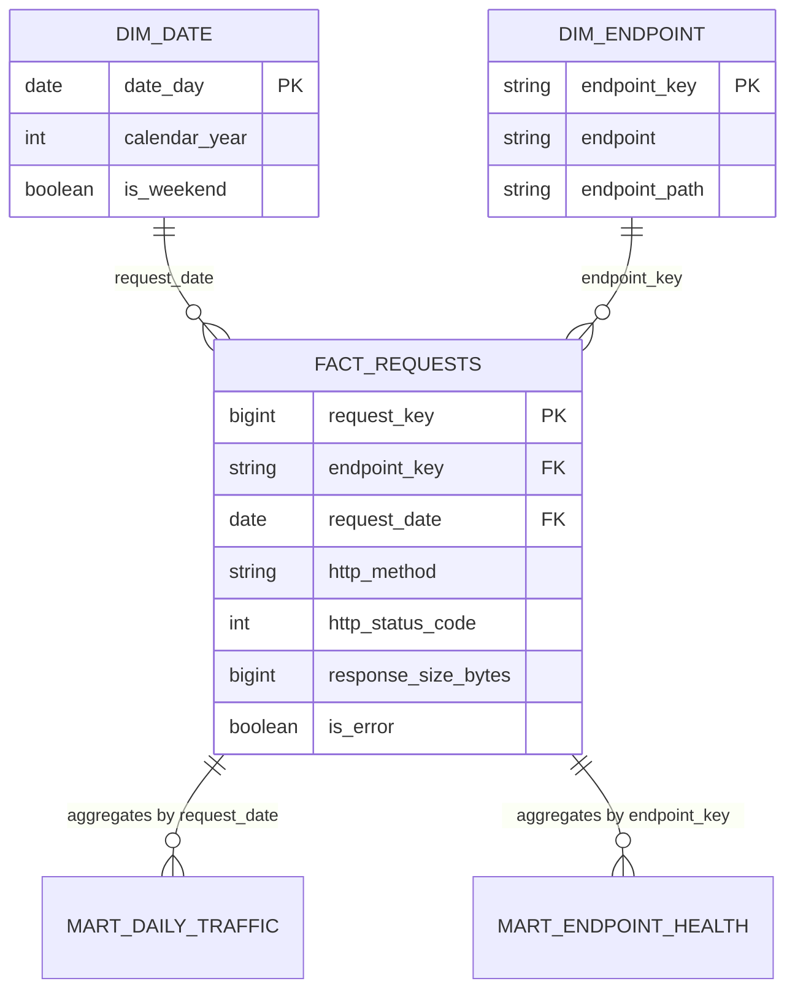

# Gold star schema

The dbt Gold layer turns validated Silver logs into a dimensional model for dashboards and downstream analysis. `fact_requests` has one row for every validated HTTP request; `dim_date` and `dim_endpoint` provide conformed descriptive context.



## Models and grain

| Model | Grain | Purpose |
|---|---|---|
| `gold.fact_requests` | One validated HTTP request | Atomic facts and dimension foreign keys. |
| `gold.dim_date` | One calendar day | Date attributes for time-series analysis. |
| `gold.dim_endpoint` | One observed endpoint | Endpoint route attributes and a deterministic key. |
| `gold.mart_daily_traffic` | One request date | Daily traffic, errors, response size, and unique-client metrics. |
| `gold.mart_endpoint_health` | One endpoint | Endpoint volume, error rate, response size, and active-date metrics. |

## Build and documentation

After generating the Silver lake and creating `dbt/profiles.yml`, run:

```bash
dbt build --project-dir dbt --profiles-dir dbt
dbt docs generate --project-dir dbt --profiles-dir dbt
dbt docs serve --project-dir dbt --profiles-dir dbt
```

`dbt build` materializes the five Gold models and executes their data-quality tests. `dbt docs generate` writes a catalog and lineage manifest to `dbt/target/`.
